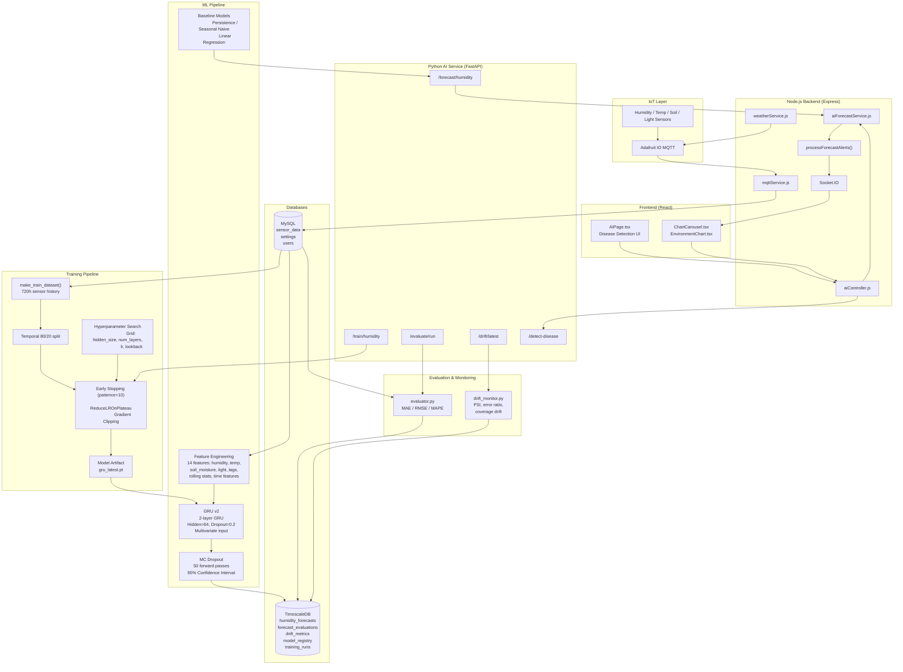
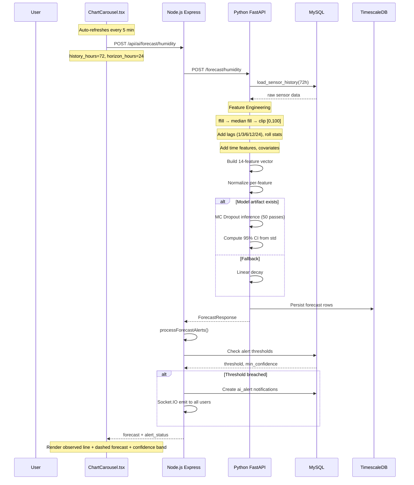
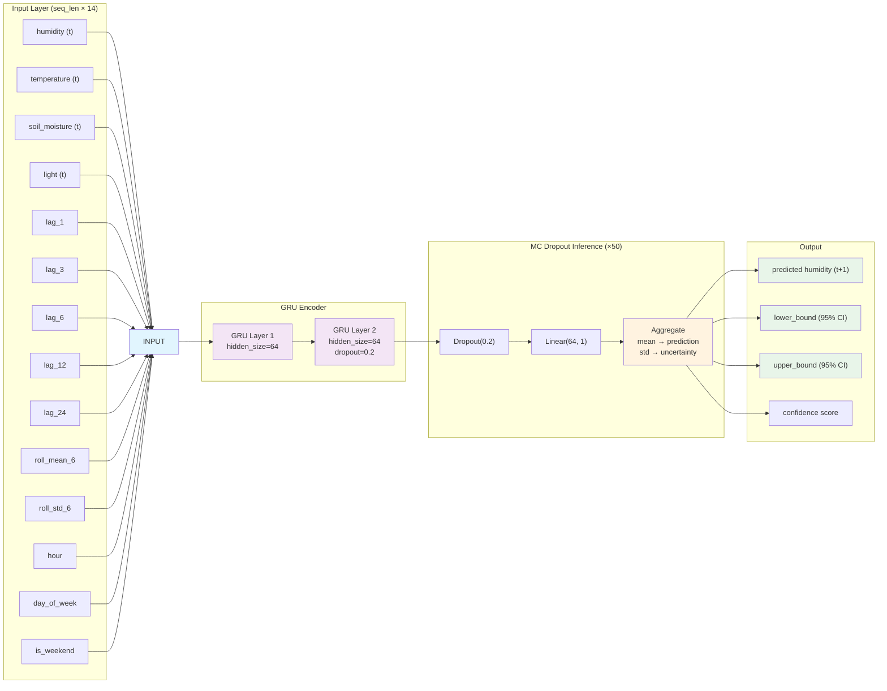
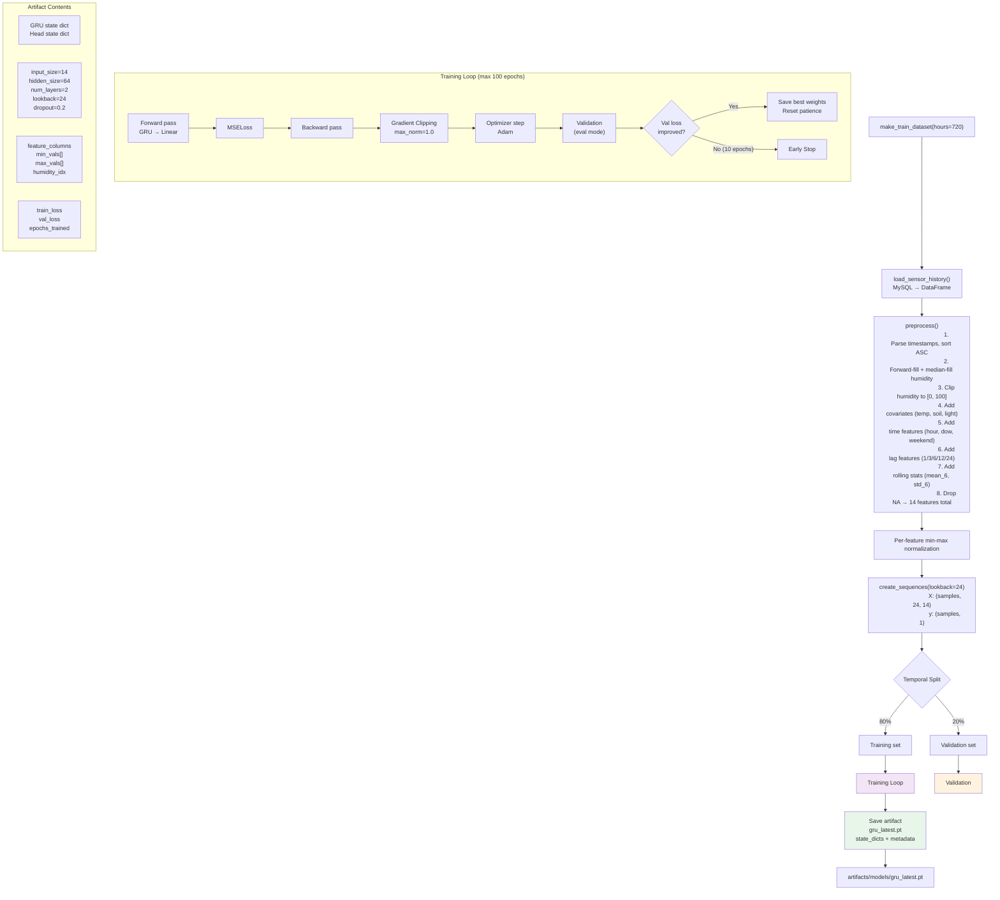
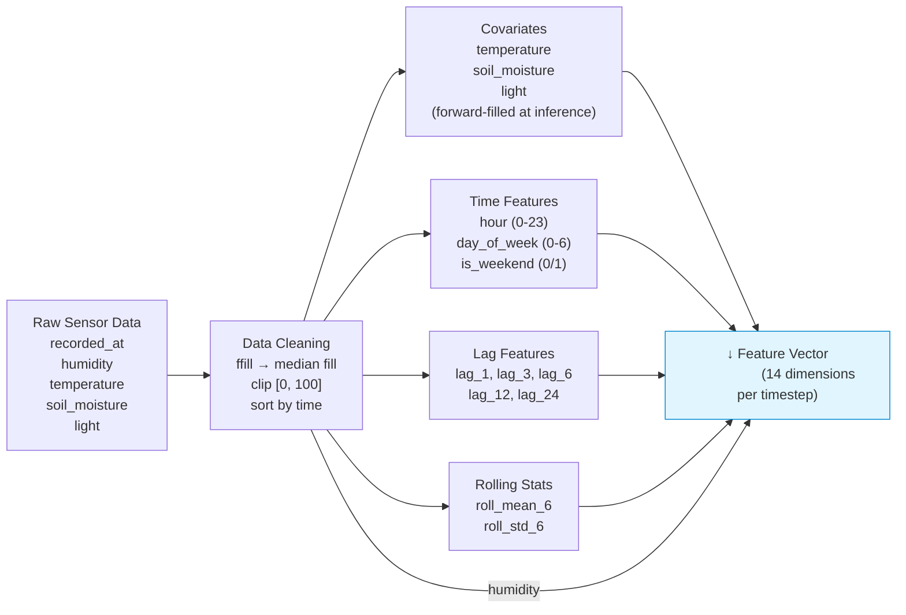
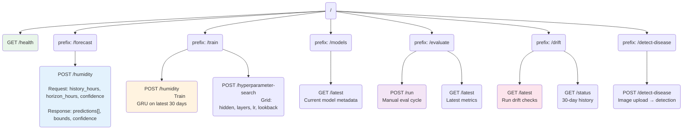
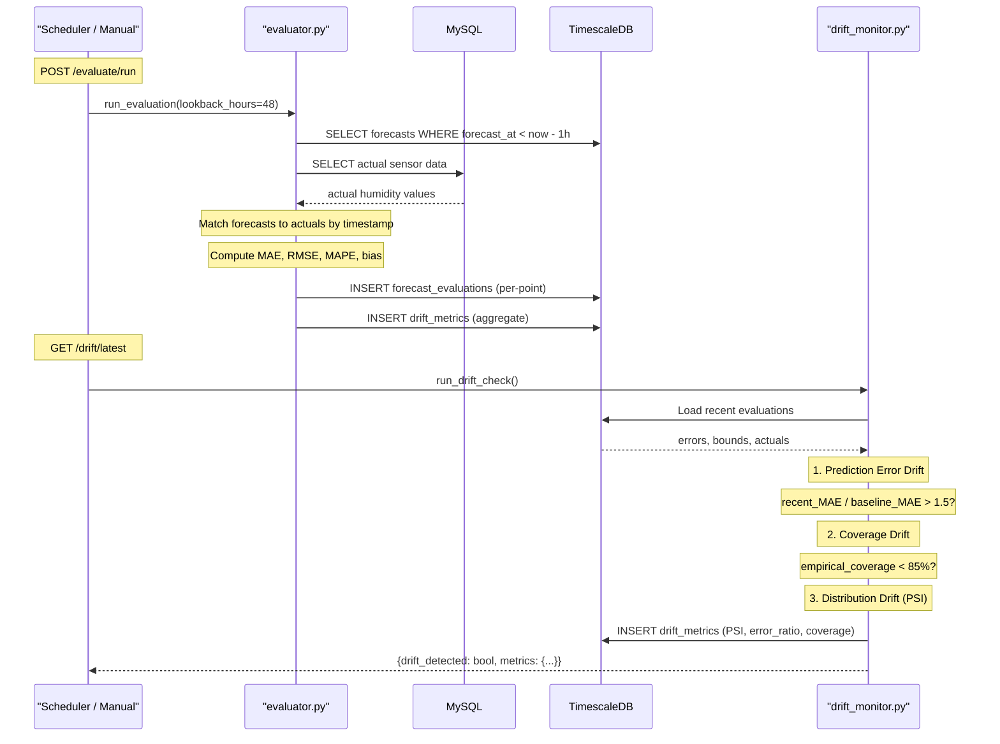
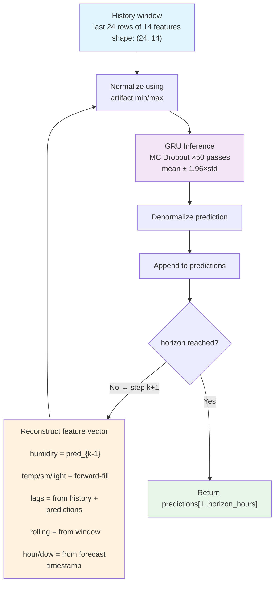
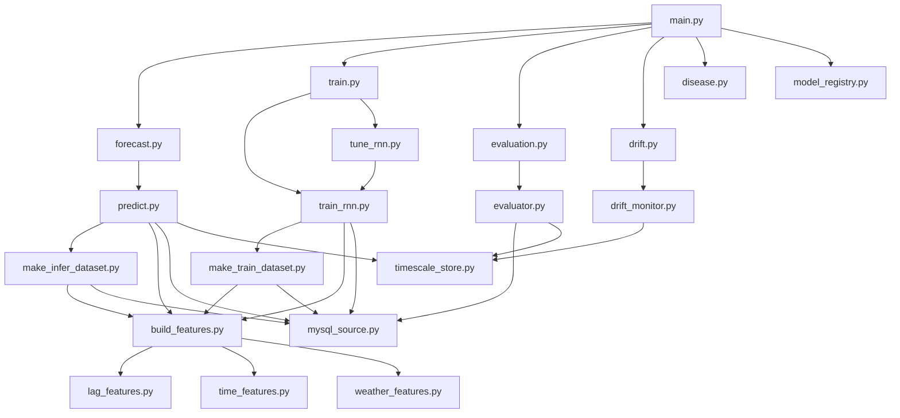

# AI Forecast System Architecture

## 1. System Context

## 2. Data Flow: Forecast Request

## 3. Model Architecture

## 4. Training Pipeline

## 5. Feature Engineering Detail

## 6. API Route Map

## 7. Evaluation & Drift Monitoring

## 8. Auto-Regressive Inference

## 9. Key Design Decisions

| Decision | Choice | Rationale |
|----------|--------|-----------|
| **Model type** | GRU (not LSTM/Transformer) | Good balance of capacity and training speed for IoT sensor data |
| **Input features** | 14 features (multivariate) | Lag/rolling/time features capture temporal patterns that raw humidity alone misses |
| **Uncertainty** | MC Dropout (not quantile regression) | Minimal architecture changes, reuses existing dropout layers |
| **Validation** | Temporal 80/20 split (not random) | Prevents data leakage in time series |
| **Normalization** | Per-feature min-max (not global) | Preserves relative feature magnitudes, stored in artifact for inference |
| **Evaluation DB** | TimescaleDB (separate from MySQL) | Time-optimized hypertables for forecast data, avoids impacting operational queries |
| **Alerting** | Node.js orchestrates (Python forecasts) | Alert debounce, user notifications, and Socket.IO already exist in Node |
| **Baseline** | Linear regression + naive | Validates that GRU complexity is justified by performance improvement |

## 10. File Dependency Graph

