# Task 1: Giới thiệu đề tài

Trong bối cảnh nông nghiệp công nghệ cao ngày càng phát triển, đặc biệt là mô hình nhà kính giúp con người kiểm soát chặt chẽ các yếu tố như ánh sáng, nhiệt độ, độ ẩm và chất lượng không khí, việc tối ưu hóa quy trình tưới tiêu vẫn luôn là thách thức. Chúng tôi đề xuất phát triển một hệ thống giám sát và chăm sóc cây trồng thông minh tích hợp trí tuệ nhân tạo (YoloFarm) nhằm xây dựng một giải pháp nông nghiệp thông minh toàn diện, không chỉ dừng lại ở việc giám sát thông số môi trường mà còn có khả năng thấu hiểu sức khỏe cây trồng thông qua AI để đưa ra các biện pháp chăm sóc chủ động.

Về công nghệ, chúng tôi sử dụng mạch YOLO:bit làm trung tâm thu thập dữ liệu và điều khiển các thiết bị ngoại vi. Đồng thời, tích hợp trí tuệ nhân tạo để dự báo các biến động môi trường dựa trên dữ liệu lịch sử, nhận diện sâu bệnh dựa trên hình ảnh để đưa ra các cảnh báo sớm.

---

# Task 2: Yêu cầu người dùng

## 2.1. Yêu cầu chức năng

### 2.1.1. Nhóm chức năng giám sát và thu thập

1. Hệ thống phải tự động thu thập thông tin về nhiệt độ, độ ẩm không khí và độ ẩm đất thông qua các cảm biến kết nối với mạch YOLO:bit.
2. Dữ liệu cảm biến phải được gửi về máy chủ trung tâm thông qua kết nối Wi-fi theo thời gian thực.
3. Các thông số cơ bản và trạng thái hệ thống phải được hiển thị trực tiếp trên ma trận LED của YOLO:bit để người dùng theo dõi nhanh.

### 2.1.2. Nhóm chức năng phân tích

1. Hệ thống phải dự báo được xu hướng (nhiệt độ/ độ ẩm) trong tương lai gần dựa trên dữ liệu đã thu thập để đưa ra cảnh báo sớm.
2. Hệ thống phải tự động phân tích hình ảnh lá cây được cung cấp từ người dùng và xác định được cây đang khỏe mạnh hay bị nhiễm loại sâu bệnh cụ thể nào.

### 2.1.3. Nhóm chức năng điều khiển và tương tác

1. Tự động kích hoạt hệ thống tưới tiêu dựa trên ngưỡng thông số cài đặt, theo lịch của người dùng hoặc đề xuất từ mô hình AI.
2. Cung cấp giao diện web/app để người dùng theo dõi biểu đồ dữ liệu, nhận và xem các thông báo, điều khiển thiết bị từ xa.

## 2.2. Yêu cầu phi chức năng

Hệ thống cần có một số yêu cầu phi chức năng liên quan đến hiệu năng, độ chính xác, tính ổn định và khả năng mở rộng nhằm đáp ứng sự thuận tiện cho người dùng và đảm bảo rằng hệ thống hoạt động hiệu quả hơn. Các yêu cầu phi chức năng cụ thể như sau:

1. **Hiệu năng:** Thời gian phản hồi từ khi cảm biến ghi nhận dữ liệu đến khi hiển thị trên dashboard không vượt quá 3 giây.
2. **Độ chính xác:** Mô hình nhận diện sâu bệnh phải đạt độ chính xác tối thiểu 80% trên tập dữ liệu thử nghiệm.
3. **Tính ổn định:** Hệ thống phải có khả năng tự động khôi phục lại kết nối khi tín hiệu Wi-fi bị gián đoạn.
4. **Khả năng mở rộng:** Hệ thống có thể tích hợp thêm các loại cảm biến mới (cảm biến ánh sáng, nồng độ CO₂) mà không cần thay đổi cấu trúc cốt lõi.
5. **Dễ sử dụng:** Giao diện Dashboard phải trực quan, hỗ trợ ngôn ngữ tiếng Việt để người dùng dễ dàng thao tác.

---

# Task 3: Use-cases

## 3.1. Use-case -- Toàn bộ hệ thống

### 3.1.1. Diagram

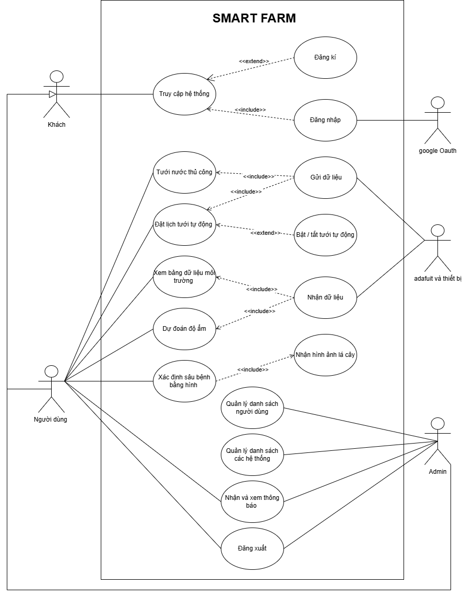

### 3.1.2. Details (Scenario)

#### UC-01: Truy cập hệ thống

| Thuộc tính | Mô tả |
|---|---|
| **Use-case ID** | UC-01 |
| **Use-case Name** | Truy cập hệ thống |
| **Use-case Overview** | Xác thực khách truy cập hệ thống và phân quyền người dùng. |
| **Actors** | Guest (Khách) |
| **Preconditions** | Khách truy cập hệ thống thành công và hệ thống hoạt động bình thường. |
| **Trigger** | Khách chọn nút đăng nhập hoặc đăng kí tài khoản. |
| **Basic flow** | 1. Khách truy cập hệ thống.   2. Khách chọn hình thức đăng nhập (trực tiếp hoặc Google account).   3. Nếu chọn đăng nhập trực tiếp, chọn mục "Đăng nhập".   4. Khách nhập thông tin đăng nhập vào ô tương ứng (tên đăng nhập/ mật khẩu).   5. Hệ thống đối chiếu thông tin đăng nhập của khách với dữ liệu được lưu ở database.   6. Nếu khớp thông tin, hệ thống sẽ phân quyền cho khách là người dùng hoặc là admin.   7. Chuyển người đó tới giao diện tương ứng với vai trò đã phân (user/ admin). |
| **Post conditions** | Người dùng/ admin truy cập được hệ thống với giao diện tương ứng. |
| **Alternative flow** | A1. Ở bước 3, nếu chọn đăng nhập theo Google account thì hệ thống chuyển hướng người dùng đến trang xác thực của Google và Google OAuth sẽ xác thực tài khoản.   A2. Ở bước 3, nếu chọn đăng nhập trực tiếp mà chưa có tài khoản thì khách chọn mục "đăng kí" để điền thông tin người dùng, tên đăng nhập và mật khẩu. |
| **Exception flow** | E1: Ở bước 6, nếu thông tin không khớp thì hệ thống báo lỗi "tài khoản không đúng tên đăng nhập hoặc mật khẩu" và khách phải nhập lại thông tin đăng nhập.   E2: Ở bước 7, nếu thông tin đăng nhập không khớp thì vẫn giữ nguyên màn hình đăng nhập. |
| **Special requirements** | Không có. |
| **Extension points** | Không có. |

#### UC-02: Dự đoán độ ẩm

| Thuộc tính | Mô tả |
|---|---|
| **Use-case ID** | UC-02 |
| **Use-case Name** | Dự đoán độ ẩm |
| **Use-case Overview** | Hệ thống dự đoán độ ẩm đất dựa trên dữ liệu từ cảm biến độ ẩm đất và cảm biến nhiệt độ -- độ ẩm DHT20. |
| **Actors** | User |
| **Preconditions** | Hệ thống đã kết nối Internet và cảm biến hoạt động bình thường. |
| **Trigger** | Người dùng chọn chức năng dự đoán độ ẩm trên dashboard. |
| **Basic flow** | 1. Người dùng truy cập dashboard.   2. Người dùng chọn chức năng "Dự đoán độ ẩm".   3. Hệ thống thu thập dữ liệu từ cảm biến độ ẩm đất.   4. Hệ thống thu thập dữ liệu nhiệt độ và độ ẩm không khí từ cảm biến DHT20.   5. Hệ thống gửi dữ liệu đến server xử lý.   6. Server phân tích dữ liệu và thực hiện dự đoán độ ẩm đất.   7. Server gửi kết quả dự đoán về hệ thống.   8. Hệ thống hiển thị kết quả dự đoán trên dashboard. |
| **Post conditions** | Hệ thống hiển thị kết quả dự đoán độ ẩm. |
| **Alternative flow** | Tại bước 1 nếu hệ thống được cấu hình dự đoán tự động theo chu kỳ thì hệ thống tự động thu thập dữ liệu và thực hiện các bước 3 → 8 mà không cần người dùng kích hoạt. |
| **Exception flow** | E1: Tại bước 3 nếu cảm biến độ ẩm đất không gửi dữ liệu thì hệ thống hiển thị thông báo lỗi và dừng quá trình dự đoán.   E2: Tại bước 5 nếu hệ thống không kết nối được với server thì quá trình xử lý dữ liệu bị hủy và hệ thống hiển thị thông báo lỗi. |
| **Special requirements** | Không có. |
| **Extension points** | Không có. |

#### UC-03: Xác định sâu bệnh dựa trên hình ảnh

| Thuộc tính | Mô tả |
|---|---|
| **Use-case ID** | UC-03 |
| **Use-case Name** | Xác định sâu bệnh dựa trên hình ảnh |
| **Use-case Overview** | Hệ thống nhận hình ảnh cây trồng từ người dùng hoặc camera và sử dụng mô hình AI để phân tích, xác định loại sâu bệnh có thể xuất hiện trên cây. |
| **Actors** | User |
| **Preconditions** | 1. Hệ thống đã kết nối Internet.   2. Camera hoặc chức năng tải ảnh hoạt động bình thường.   3. Server AI sẵn sàng xử lý dữ liệu. |
| **Trigger** | Người dùng chọn chức năng "Xác định sâu bệnh" trên dashboard. |
| **Basic flow** | 1. Người dùng truy cập dashboard.   2. Người dùng chọn chức năng "Xác định sâu bệnh".   3. Người dùng chụp ảnh cây trồng hoặc tải ảnh từ thiết bị lên hệ thống.   4. Hệ thống gửi hình ảnh đến server xử lý.   5. Server phân tích hình ảnh bằng mô hình AI.   6. Server xác định loại sâu bệnh (nếu có).   7. Server gửi kết quả dự đoán về hệ thống.   8. Hệ thống hiển thị kết quả nhận diện sâu bệnh trên dashboard. |
| **Post conditions** | Hệ thống hiển thị kết quả nhận diện sâu bệnh và thông tin liên quan cho người dùng. |
| **Alternative flow** | Tại bước 3 nếu hệ thống được cấu hình sử dụng camera tự động thì camera sẽ định kỳ chụp ảnh và gửi lên server để phân tích mà không cần người dùng thực hiện. |
| **Exception flow** | E1: Tại bước 3 nếu người dùng không tải ảnh hoặc camera không hoạt động thì hệ thống hiển thị thông báo lỗi và yêu cầu thử lại.   E2: Tại bước 4 nếu hệ thống không gửi được dữ liệu đến server thì quá trình phân tích bị hủy và hệ thống hiển thị thông báo lỗi. |
| **Special requirements** | Không có. |
| **Extension points** | Không có. |

#### UC-04: Xem bảng dữ liệu môi trường

| Thuộc tính | Mô tả |
|---|---|
| **Use-case ID** | UC-04 |
| **Use-case Name** | Xem bảng dữ liệu môi trường |
| **Use-case Overview** | Người dùng xem các thông số môi trường được thu thập từ hệ thống cảm biến như nhiệt độ không khí, độ ẩm không khí và độ ẩm đất. |
| **Actors** | User |
| **Preconditions** | Hệ thống đang thu thập dữ liệu từ cảm biến. |
| **Trigger** | Người dùng truy cập dashboard. |
| **Basic flow** | 1. Người dùng truy cập dashboard.   2. Hệ thống yêu cầu dữ liệu từ các cảm biến.   3. Hệ thống nhận dữ liệu nhiệt độ và độ ẩm không khí từ cảm biến.   4. Hệ thống nhận dữ liệu từ cảm biến độ ẩm đất.   5. Hệ thống xử lý dữ liệu.   6. Hệ thống hiển thị dữ liệu trên dashboard dưới dạng bảng hoặc biểu đồ. |
| **Post conditions** | Dữ liệu môi trường được hiển thị cho người dùng. |
| **Alternative flow** | Tại bước 6 nếu người dùng chọn xem dữ liệu lịch sử thì hệ thống hiển thị biểu đồ dữ liệu môi trường theo thời gian. |
| **Exception flow** | E1: Tại bước 3 hoặc bước 4 nếu hệ thống không nhận được dữ liệu từ cảm biến thì dashboard hiển thị trạng thái "No Data".   E2: Tại bước 2 nếu dashboard không kết nối được server thì dữ liệu không thể hiển thị và hệ thống thông báo lỗi. |
| **Special requirements** | Không có. |
| **Extension points** | Không có. |

#### UC-05: Tưới nước thủ công

| Thuộc tính | Mô tả |
|---|---|
| **Use-case ID** | UC-05 |
| **Use-case Name** | Tưới nước thủ công |
| **Use-case Overview** | Người dùng có thể chủ động bật hoặc tắt hệ thống tưới nước thông qua dashboard để tưới cây ngay lập tức. |
| **Actors** | User |
| **Preconditions** | 1. Hệ thống đang hoạt động bình thường.   2. Người dùng đã truy cập dashboard.   3. Máy bơm nước được kết nối với hệ thống. |
| **Trigger** | Người dùng chọn chức năng "Tưới nước thủ công" trên dashboard. |
| **Basic flow** | 1. Người dùng truy cập dashboard.   2. Người dùng chọn chức năng "Tưới nước thủ công".   3. Hệ thống hiển thị nút điều khiển bật/tắt máy bơm.   4. Người dùng chọn bật máy bơm.   5. Hệ thống gửi tín hiệu điều khiển đến bộ điều khiển máy bơm.   6. Máy bơm bắt đầu hoạt động và tưới cây.   7. Khi người dùng chọn tắt máy bơm, hệ thống gửi tín hiệu dừng.   8. Máy bơm ngừng hoạt động. |
| **Post conditions** | Máy bơm nước được kích hoạt hoặc tắt theo thao tác của người dùng. |
| **Alternative flow** | Tại bước 4 nếu người dùng đặt thời gian tưới cụ thể thì hệ thống tự động tắt máy bơm sau khi hết thời gian đã chọn. |
| **Exception flow** | E1: Tại bước 5 nếu hệ thống không gửi được tín hiệu điều khiển đến máy bơm thì hệ thống hiển thị thông báo lỗi.   E2: Tại bước 6 nếu máy bơm không phản hồi thì hệ thống hiển thị trạng thái lỗi và yêu cầu người dùng kiểm tra thiết bị. |
| **Special requirements** | Không có. |
| **Extension points** | Không có. |

#### UC-06: Đặt lịch tưới nước tự động

| Thuộc tính | Mô tả |
|---|---|
| **Use-case ID** | UC-06 |
| **Use-case Name** | Đặt lịch tưới nước tự động |
| **Use-case Overview** | Người dùng thiết lập lịch tưới nước tự động cho hệ thống. Khi đến thời gian đã đặt, hệ thống sẽ kích hoạt máy bơm để tưới cây. |
| **Actors** | User |
| **Preconditions** | Hệ thống đã kết nối Internet và máy bơm nước hoạt động bình thường. |
| **Trigger** | Người dùng chọn chức năng đặt lịch tưới nước. |
| **Basic flow** | 1. Người dùng truy cập dashboard.   2. Người dùng chọn chức năng "Đặt lịch tưới nước".   3. Người dùng nhập thời gian bắt đầu và thời gian tưới.   4. Hệ thống lưu lịch tưới.   5. Khi đến thời gian đã đặt, hệ thống kích hoạt máy bơm nước.   6. Sau khi hết thời gian tưới, hệ thống tắt máy bơm. |
| **Post conditions** | Lịch tưới được lưu và hệ thống thực hiện tưới tự động. |
| **Alternative flow** | A1: Tại bước 4 nếu người dùng muốn thay đổi lịch tưới thì hệ thống cho phép chỉnh sửa và lưu lại lịch mới.   A2: Tại bước 2 nếu người dùng tắt chế độ tưới tự động thì hệ thống không thực hiện lịch tưới đã đặt. |
| **Exception flow** | E1: Tại bước 3 nếu thời gian người dùng nhập không hợp lệ thì hệ thống yêu cầu người dùng nhập lại.   E2: Tại bước 5 nếu máy bơm không phản hồi thì hệ thống hiển thị thông báo lỗi và không thực hiện tưới nước. |
| **Special requirements** | Không có. |
| **Extension points** | Không có. |

#### UC-07: Nhận và xem thông báo

| Thuộc tính | Mô tả |
|---|---|
| **Use-case ID** | UC-07 |
| **Use-case Name** | Nhận và xem thông báo |
| **Use-case Overview** | Hệ thống gửi thông báo đến người dùng khi xảy ra các sự kiện quan trọng như độ ẩm đất thấp, phát hiện sâu bệnh, lỗi cảm biến hoặc hệ thống tưới nước. Hoặc gửi thông báo đến admin về những thay đổi mà admin đã thực hiện. |
| **Actors** | User, Admin |
| **Preconditions** | 1. Hệ thống đã kết nối Internet.   2. Người dùng/ admin đã đăng nhập vào hệ thống. |
| **Trigger** | Hệ thống phát hiện một sự kiện cần thông báo. |
| **Basic flow** | 1. Hệ thống phát hiện sự kiện cần thông báo.   2. Hệ thống tạo thông báo với nội dung tương ứng.   3. Hệ thống gửi thông báo đến dashboard hoặc ứng dụng của người dùng hoặc admin.   4. Người dùng hoặc admin mở mục thông báo trên dashboard.   5. Hệ thống hiển thị danh sách các thông báo.   6. Người dùng hoặc admin chọn một thông báo để xem chi tiết. |
| **Post conditions** | Người dùng hoặc admin nhận được và xem nội dung thông báo. |
| **Alternative flow** | Tại bước 3 nếu người dùng bật thông báo qua email hoặc ứng dụng di động thì hệ thống gửi thông báo qua các kênh này. |
| **Exception flow** | E1: Tại bước 3 nếu hệ thống không kết nối được Internet thì thông báo sẽ được lưu lại và gửi khi kết nối được khôi phục.   E2: Tại bước 4 nếu người dùng chưa đăng nhập thì hệ thống yêu cầu đăng nhập trước khi xem thông báo. |
| **Special requirements** | Không có. |
| **Extension points** | Không có. |

#### UC-08: Đăng xuất

| Thuộc tính | Mô tả |
|---|---|
| **Use-case ID** | UC-08 |
| **Use-case Name** | Đăng xuất |
| **Use-case Overview** | Người dùng/ admin chọn đăng xuất, hệ thống hiển thị lại màn hình đăng nhập và xóa bỏ phân quyền người dùng hiện tại. |
| **Actors** | User, Admin |
| **Preconditions** | 1. Người dùng đã đăng nhập vào hệ thống.   2. Người dùng, admin đang ở trong hệ thống. |
| **Trigger** | Người dùng/ admin nhấn vào nút "đăng xuất". |
| **Basic flow** | 1. Người dùng/ admin nhấn vào nút đăng xuất.   2. Hệ thống hiển thị thông báo yêu cầu xác nhận việc đăng xuất.   3. Nếu chấp nhận, hệ thống xóa bỏ phân quyền hiện tại và chuyển hướng về giao diện đăng nhập. |
| **Post conditions** | Người dùng/ admin bị xóa bỏ phân quyền và trở lại là khách; hệ thống chuyển hướng về màn hình đăng nhập. |
| **Alternative flow** | Tại bước 3, nếu không chấp nhận thì hệ thống hủy bỏ việc đăng xuất và vẫn giữ nguyên quyền của người dùng này. |
| **Exception flow** | Không có. |
| **Special requirements** | Không có. |
| **Extension points** | Không có. |

## 3.2. Use-case chi tiết cho role Admin

### 3.2.1. Diagram

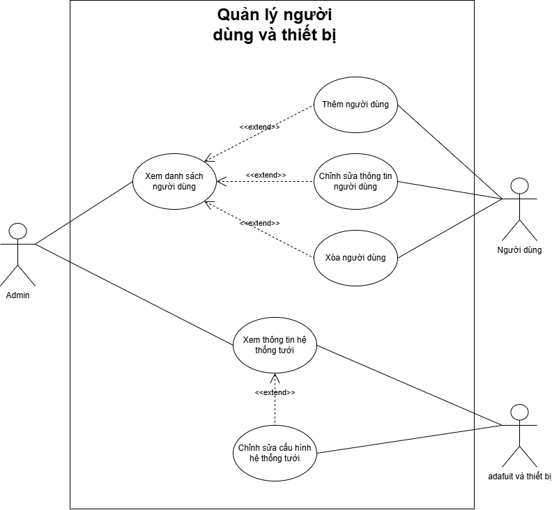

### 3.2.2. Details (Scenario)

#### UC-B01: Xem danh sách người dùng

| Thuộc tính | Mô tả |
|---|---|
| **Use-case ID** | UC-B01 |
| **Use-case Name** | Xem danh sách người dùng |
| **Use-case Overview** | Admin có thể xem danh sách các người dùng đã đăng kí tài khoản vào hệ thống, ngoài ra còn có thể thêm người dùng, chỉnh sửa thông tin hoặc xóa tài khoản người dùng đã đăng kí trước đó. |
| **Actors** | Admin, Users |
| **Preconditions** | Admin đăng nhập thành công vào hệ thống. |
| **Trigger** | Admin truy cập vào mục quản lý người dùng. |
| **Basic flow** | 1. Admin truy cập vào mục quản lý người dùng.   2. Admin chọn các chức năng đặc quyền: thêm, chỉnh sửa thông tin, xóa người dùng.   3. Nếu chọn thêm người dùng, admin có thể tạo một tài khoản người dùng mới bằng việc thêm tên đăng nhập, mật khẩu tương ứng. Hệ thống ghi nhận và thêm vào cơ sở dữ liệu. |
| **Post conditions** | Hệ thống cập nhật lại thông tin tương ứng mà admin đã thao tác. |
| **Alternative flow** | A1. Ở bước 3, nếu admin chọn chỉnh sửa thông tin người dùng thì admin có thể chỉnh sửa thông tin cá nhân, tên đăng nhập và mật khẩu người dùng.   A2. Ở bước 3, nếu admin chọn xoá người dùng thì hệ thống sẽ xóa toàn bộ thông tin của người dùng trong cơ sở dữ liệu. |
| **Exception flow** | E1: Ở bước 2, nếu admin tìm thông tin của người dùng không tồn tại trong cơ sở dữ liệu hiện tại thì hệ thống báo lỗi. |
| **Special requirements** | Không có. |
| **Extension points** | Không có. |

#### UC-B02: Xem thông tin hệ thống tưới

| Thuộc tính | Mô tả |
|---|---|
| **Use-case ID** | UC-B02 |
| **Use-case Name** | Xem thông tin hệ thống tưới |
| **Use-case Overview** | Admin có thể xem và chỉnh sửa các thông số của các thiết bị cũng như cách bố trí các thành phần trong hệ thống. |
| **Actors** | Admin, Adafruit và thiết bị |
| **Preconditions** | Admin đăng nhập thành công vào hệ thống. |
| **Trigger** | Admin truy cập vào mục "quản lý thiết bị và hệ thống". |
| **Basic flow** | 1. Admin truy cập vào mục "quản lý thiết bị và hệ thống".   2. Admin chọn mục xem thông tin hệ thống tưới.   3. Hệ thống truy xuất dữ liệu cấu hình thiết bị từ Adafruit và cơ sở dữ liệu.   4. Hệ thống hiển thị danh sách các thiết bị trong hệ thống tưới (cảm biến độ ẩm đất, cảm biến DHT20, máy bơm nước) cùng với trạng thái hoạt động và các thông số cấu hình hiện tại.   5. Admin xem chi tiết thông tin của từng thiết bị bao gồm: tên thiết bị, trạng thái kết nối, giá trị đọc được, ngưỡng hoạt động và lịch sử hoạt động. |
| **Post conditions** | Hệ thống cập nhật lại thông tin tương ứng mà admin đã thao tác. |
| **Alternative flow** | A1. Ở bước 5, nếu admin chọn chỉnh sửa cấu hình hệ thống tưới thì hệ thống cho phép admin thay đổi các thông số như: ngưỡng độ ẩm kích hoạt tưới, thời gian tưới, tần suất đọc cảm biến. Sau khi chỉnh sửa, hệ thống gửi cấu hình mới đến Adafruit để cập nhật cho thiết bị.   A2. Ở bước 4, nếu admin chọn xem bố trí các thành phần trong hệ thống thì hệ thống hiển thị sơ đồ bố trí các cảm biến và máy bơm trong khu vực tưới. |
| **Exception flow** | E1: Ở bước 3, nếu hệ thống không kết nối được tới Adafruit thì báo lỗi. |
| **Special requirements** | Không có. |
| **Extension points** | Không có. |

---

# Task 4: Adafruit và thiết bị

## 4.1. Adafruit

### 4.1.1. Adafruit IO

Adafruit IO là một nền tảng IoTs (Internet of Things) dựa trên đám mây, giúp bạn thu thập, hiển thị và điều khiển dữ liệu từ các thiết bị kết nối internet. Đây là một dịch vụ miễn phí của Adafruit, hỗ trợ các giao thức REST API và MQTT, giúp dễ dàng kết nối các vi điều khiển như ESP8266, ESP32, Raspberry Pi, Arduino, STM32,...

### 4.1.2. Các chức năng chính của Adafruit IO

- **Feeds (Luồng dữ liệu):** Lưu trữ và quản lý dữ liệu từ cảm biến hoặc thiết bị.
- **Dashboards (Bảng điều khiển):** Cung cấp giao diện đồ họa trực quan (biểu đồ, công tắc, nút bấm,...) để giám sát dữ liệu. Có thể tạo dashboard để điều khiển thiết bị từ xa.
- **Giao thức MQTT:** Gửi dữ liệu theo thời gian thực, phù hợp với thiết bị IoT.
- **Hỗ trợ nhiều nền tảng:** Có thư viện Adafruit IO Arduino và Adafruit MQTT giúp lập trình dễ dàng. Tích hợp với ESP8266, ESP32, Arduino, Raspberry Pi, STM32, Python,...

### 4.1.3. Cách hoạt động của Adafruit IO

- Thiết bị IoT (ESP8266, ESP32,...) gửi dữ liệu lên Adafruit IO qua MQTT hoặc REST API.
- Adafruit IO lưu trữ và hiển thị dữ liệu trên giao diện trên feed.
- Người dùng có thể điều khiển thiết bị từ xa qua dashboard hoặc API. Tức là điều khiển thiết bị IoT bằng cách ra lệnh cho Adafruit IO thông qua Adafruit dashboard.

## 4.2. Thiết kế hệ thống và lựa chọn thiết bị

Ở giai đoạn đầu, nhóm tiến hành phân tích yêu cầu của hệ thống nông nghiệp thông minh và lựa chọn các thiết bị phù hợp. Hệ thống được thiết kế gồm các thành phần chính:

- **Cảm biến DHT20:** dùng để đo nhiệt độ và độ ẩm không khí.

  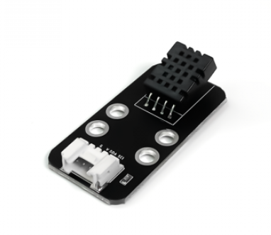

- **Cảm biến độ ẩm đất:** dùng để xác định tình trạng đất nhằm hỗ trợ hệ thống tưới tự động.

  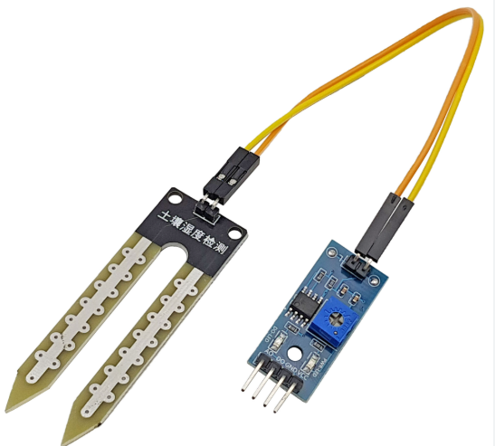

- **Cảm biến ánh sáng:** để theo dõi cường độ ánh sáng trong môi trường.

  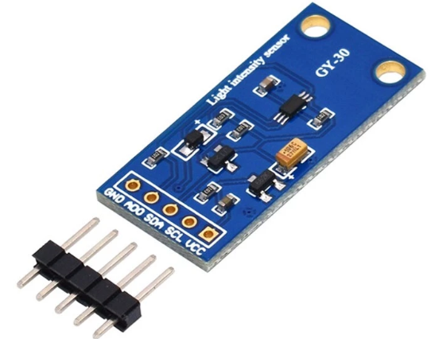

- **Đèn RGB:** dùng làm đèn báo trạng thái của hệ thống.

  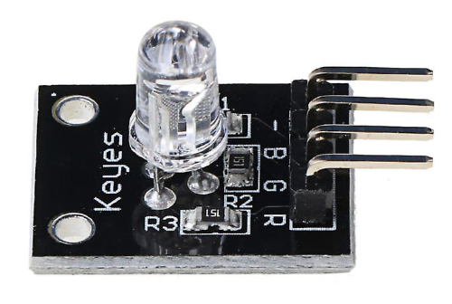

- **Màn hình LCD 16×2:** để hiển thị các thông số môi trường trực tiếp tại thiết bị.

  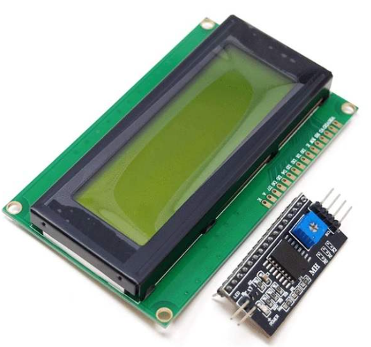

- **Hai máy bơm nước:** phục vụ chức năng tưới tự động và tưới theo thời gian.

  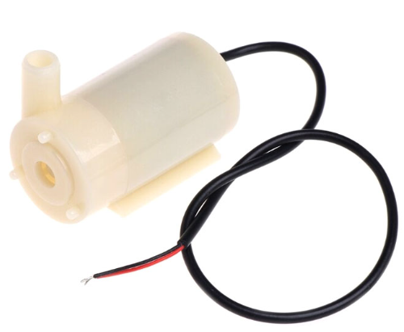

- **Động cơ RC (servo):** dùng cho chức năng hỗ trợ phân loại trái cây bằng AI.

  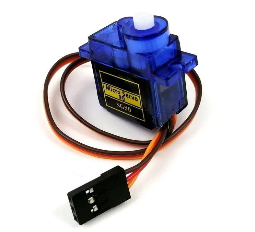

## 4.3. Kết nối phần cứng

Sau khi lựa chọn thiết bị, nhóm tiến hành thiết kế sơ đồ kết nối phần cứng. Các cảm biến và thiết bị ngoại vi được kết nối với board Yolo:Bit thông qua các cổng GPIO và giao tiếp I2C.

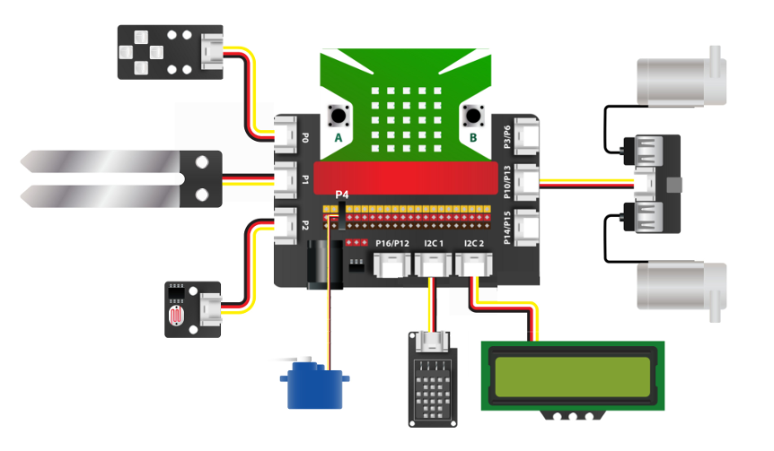

- **DHT20** được kết nối qua **I2C1** để đọc nhiệt độ và độ ẩm.
- **LCD 16x2** sử dụng **I2C2** để hiển thị dữ liệu.
- **Cảm biến độ ẩm đất** được kết nối tại **P1**.
- **Cảm biến ánh sáng** được kết nối tại **P2**.
- **Đèn RGB** được kết nối tại **P0**.
- **Động cơ RC** được điều khiển thông qua **P4**.
- **Hai máy bơm** được điều khiển qua **P10** và **P13**.

Sau khi hoàn thành kết nối, hệ thống phần cứng đã hoạt động ổn định và có thể đọc dữ liệu từ các cảm biến.

## 4.4. Thiết kế dashboard giám sát

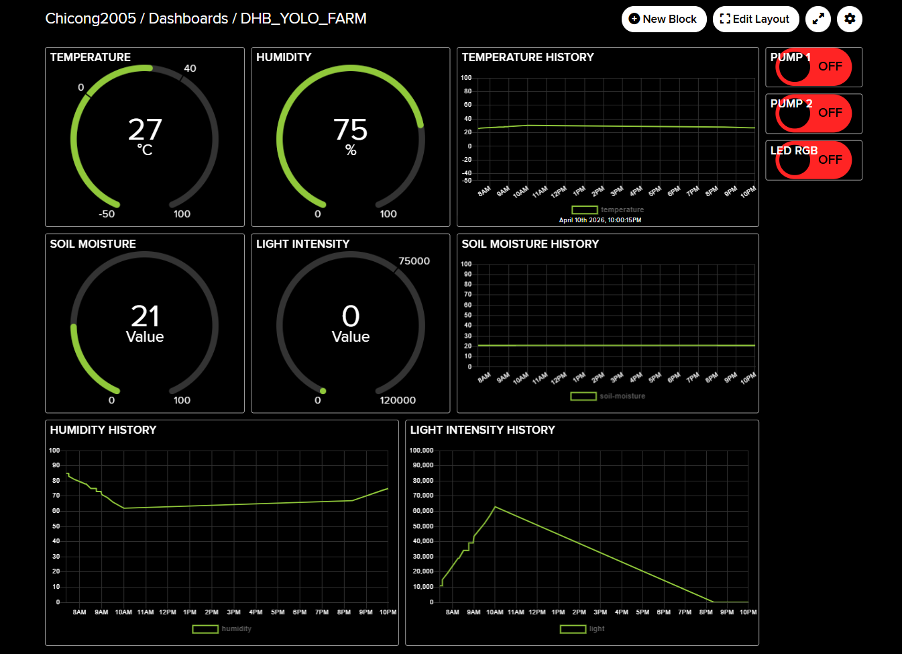

Sau khi hoàn thành giao tiếp với server, nhóm tiến hành thiết kế Dashboard trên Adafruit IO để giám sát và điều khiển hệ thống từ xa.

Dashboard bao gồm:

1. Đồng hồ hiển thị nhiệt độ và độ ẩm.
2. Đồng hồ hiển thị độ ẩm đất và cường độ ánh sáng.
3. Các biểu đồ lịch sử dữ liệu cho nhiệt độ, độ ẩm và ánh sáng.
4. Nút điều khiển LED và máy bơm từ xa.

⟹ Giao diện này cho phép người dùng theo dõi trạng thái môi trường và điều khiển thiết bị theo thời gian thực.

---

# Task 5: Hiện thực

*(Nội dung chưa được viết)*
